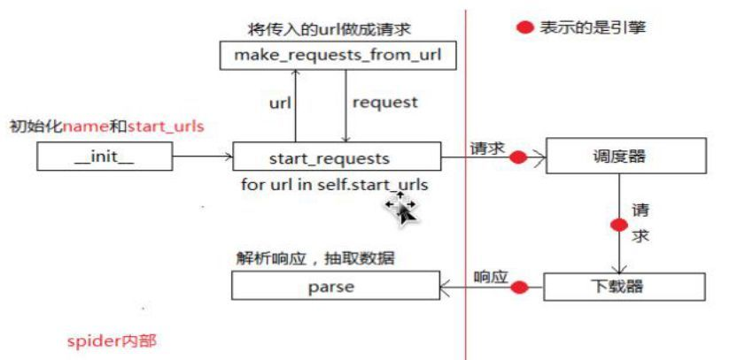

安装scrapy

```
pip install -i https://pypi.douban.com/simple/ scrapy
```

新建虚拟环境

```
Mkvirutualenv --python=/usr/local/Cellar/python@3.9/3.9.1_6/Frameworks/Python.framework/Versions/3.9/bin article
```

切换虚拟环境

```
workon article
```


## 创建scrapy-demo项目


```javascript
scrapy startproject <项目名字>
eq:
scrapy startproject scrapyDemo
```

创建爬虫命令：**在项目路径下执行**:

```javascript
scrapy genspider <爬虫名字> <允许爬取的域名>
eq:
cd scrapyDemo
scrapy genspider baidu baidu.com
```

运行项目

```javascript
scrapy crawl 项目名 [--nolog]
eq:2
scrapy crawl scrapyDemo --nolog
```

> 


## 框架结构:




# 调试

```
scrapy shell http://www.1350135.com/html/zhonghe/news/

a = response.xpath("//div[@class='class_left_list']/ul/li/a/@href")
a.extract()
```


# XPath 语法

| 选择器                                        | 备注        |
| --------------------------------------------- | ----------- |
| //div[@class='class_left_list']/ul/li/a/@href | class选择器 |
|                                               | ID选择器    |
|                                               |             |
|                                               |             |
|                                               |             |

方法

| 方法名  | 解释       |
| ------- | ---------- |
| strip() | 去掉换行符 |


## 运行一个抓取

```
scrapy runspider **.py
```

## splash渲染


## Lua脚本


